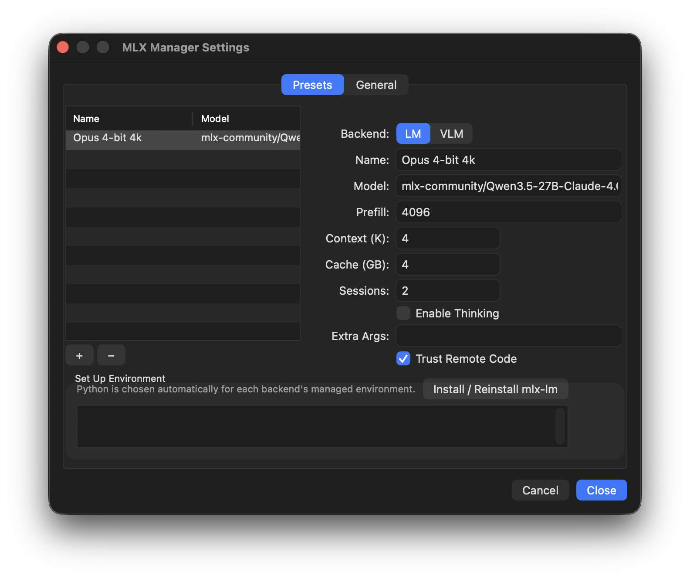

# MLX Manager


A native macOS menu bar app for managing MLX LLM/VLM server instances. Apple Silicon only.

One-click start/stop, live progress in the menu bar, config presets, environment auto-setup.


| Standby | Processing | Error |
| - | - | - |
|  |  |  |




## Features

- Menu bar icon with live progress arc during prompt processing
- Supports both `mlx-lm` and `mlx-vlm` backends
- YAML config presets (bundled defaults + user-editable)
- Auto-detects already-running server processes on launch
- Environment bootstrapping via `uv` (separate venvs per backend)
- Log viewer, request history, RAM graph
- OpenAI-compatible gateway proxy

## Stack

Swift, AppKit (NSStatusItem), XCTest, Swift Package Manager.

## Building

```sh
swift build
swift test
```

Requires macOS + Apple Silicon. No Xcode project — pure SPM.

## Working on This Repo

1. Read `AGENTS.md` — defines the TDD workflow
2. Read `docs/PROJECT.md` for architecture and domain context
3. Read `docs/SPEC.md` for requirements
